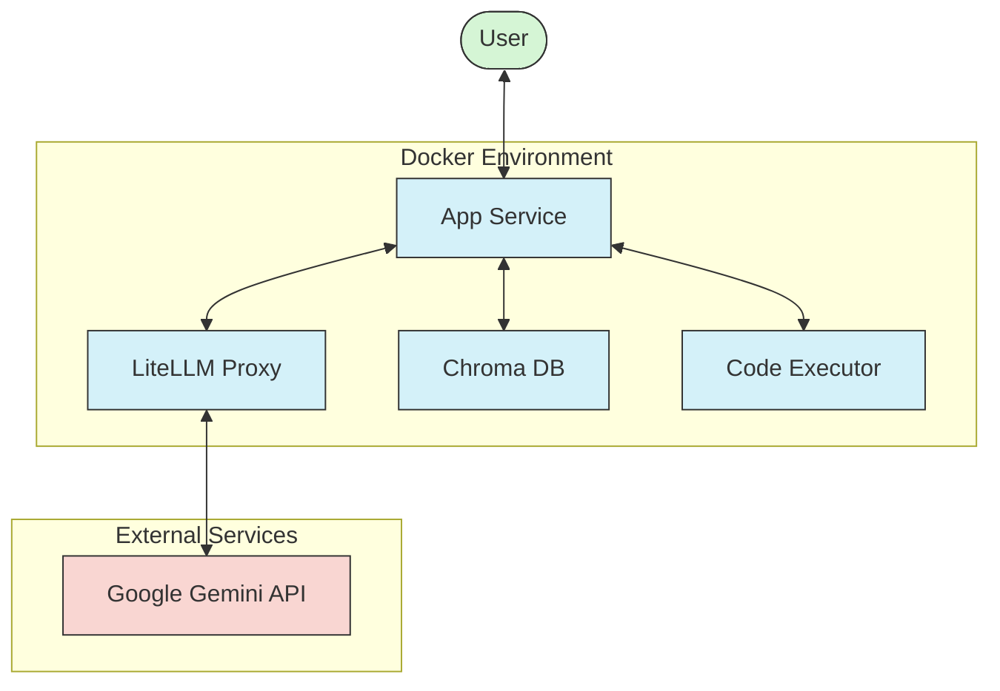

# Python Tutor Agent

A Python tutoring agent powered by LLMs that can answer Python programming questions and provide explanations.

## Architecture

The application consists of several components running in Docker containers:

1. **App Service**: A FastAPI application that handles user requests and serves as the main entry point.
   - Processes chat messages
   - Routes requests to the appropriate LLM service
   - Handles session management

2. **LiteLLM Proxy**: Serves as a gateway to various LLM providers.
   - Provides a unified API for different LLM models
   - Handles authentication and rate limiting
   - Currently configured to use Google's Gemini 2.0 Flash model

3. **Chroma**: Vector database for storing and retrieving embeddings.
   - Enables knowledge retrieval for answering specific questions
   - Supports semantic search capabilities

4. **Code Executor**: A service for executing Python code snippets.
   - Provides a safe environment for running user code
   - Returns execution results

### Architecture Diagram



### Data Flow

1. User sends a message to the `/chat` endpoint
2. The app service processes the message and determines the appropriate action
3. For LLM requests, the app communicates with the LiteLLM proxy
4. The LiteLLM proxy forwards the request to the configured model (Gemini 2.0 Flash)
5. The response is returned to the user

## Requirements

- Docker and Docker Compose
- Google API Key for accessing Gemini models

## Configuration

### Environment Variables

Create a `.env` file in the root directory with the following variables:

```
GOOGLE_API_KEY=your_google_api_key_here
LITELLM_LOG_LEVEL=debug
```

### LiteLLM Configuration

The LiteLLM proxy is configured in `litellm-config/config.yaml`. The current configuration uses the Gemini 2.0 Flash model.

## Running the Application

1. Make sure Docker is installed and running
2. Set up the environment variables in a `.env` file
3. Start the application using Docker Compose:

```bash
docker compose up -d
```

4. Access the application at http://localhost:8000

## API Endpoints

- **POST /chat**: Send a message to the tutor agent
  - Request body: `{"message": "Your question about Python here"}`
  - Response: `{"response": "Agent's response", "session_id": "unique_session_id"}`

## Troubleshooting

- If you encounter issues with the LiteLLM service, check the logs:
  ```bash
  docker compose logs litellm
  ```

- To restart all services:
  ```bash
  docker compose down && docker compose up -d
  ```

## Development

To modify the application:

1. Update the code in the `app` directory
2. Rebuild and restart the containers:
   ```bash
   docker compose down && docker compose up --build -d
   ```