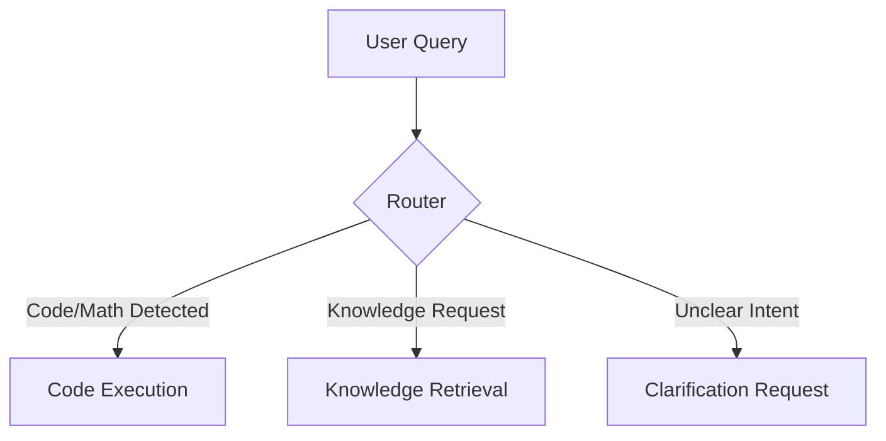
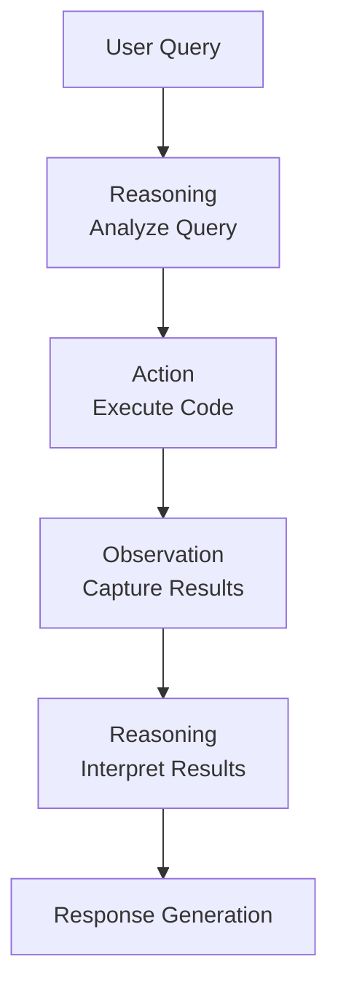
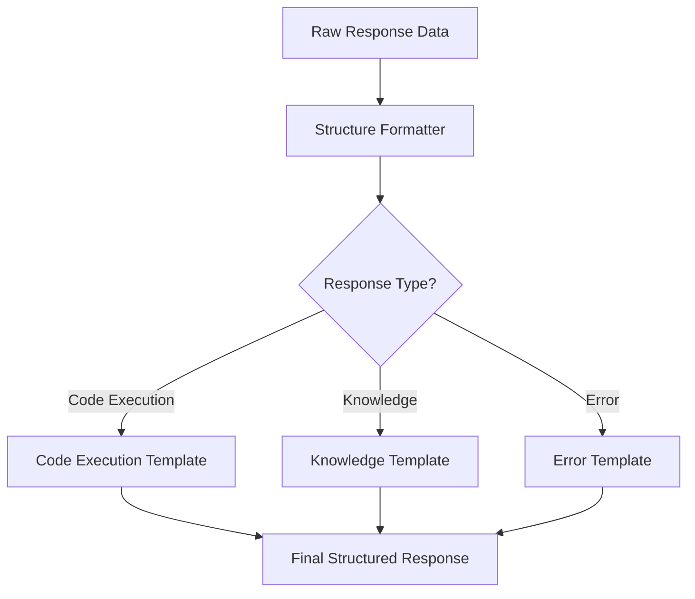
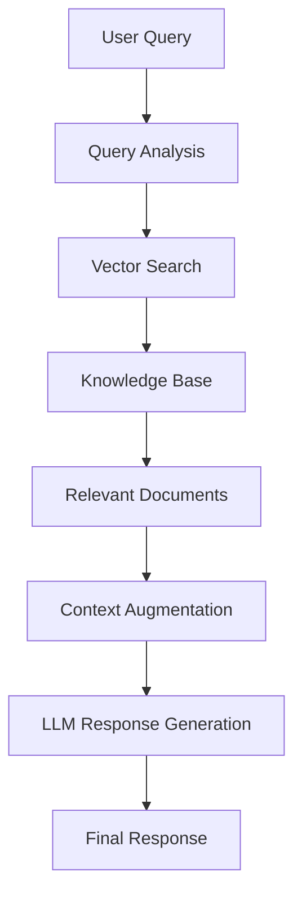
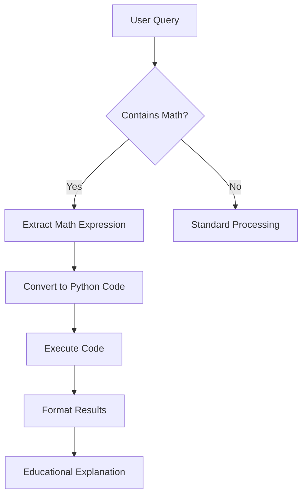

# LLM Design Patterns for Educational Agents

This document outlines key design patterns implemented in the Python Tutor Agent and provides guidance on how to present them in your webinar.

## Core Design Patterns

### 1. Router Pattern

**Description**: Intelligently routes user queries to the appropriate processing path based on content analysis.

**Implementation in Python Tutor Agent**:
- Located in `agent.py` in the `route_query` function
- Uses pattern matching to detect code execution requests, mathematical expressions, and knowledge queries
- Makes intelligent decisions about which path to prioritize

**Visualization**:


**Key Points for Presentation**:
- Show how the router analyzes query content beyond simple keywords
- Demonstrate the decision tree with real examples
- Highlight how mathematical expressions are detected and prioritized

### 2. ReAct Pattern (Reasoning and Acting)

**Description**: Combines reasoning about a problem with taking actions to solve it, creating a loop of thought-action-observation.

**Implementation in Python Tutor Agent**:
- Code execution path reasons about user code, executes it, and interprets results
- Mathematical expression handling converts natural language to code, executes it, and explains the process

**Visualization**:


**Key Points for Presentation**:
- Show how the agent reasons about what code to execute
- Demonstrate the execution and result interpretation process
- Highlight how errors are handled and explained

### 3. Structured Output Pattern

**Description**: Ensures consistent, well-formatted responses with clear sections and educational content.

**Implementation in Python Tutor Agent**:
- Response format with distinct sections (Explanation, Code Analysis, Execution Results, etc.)
- Markdown formatting for improved readability
- Emoji usage to make sections visually distinct

**Visualization**:


**Key Points for Presentation**:
- Show before/after examples of structured vs. unstructured responses
- Demonstrate how the structure improves comprehension
- Highlight how the frontend renders the markdown structure

### 4. RAG Pattern (Retrieval-Augmented Generation)

**Description**: Enhances LLM responses by retrieving relevant information from a knowledge base.

**Implementation in Python Tutor Agent**:
- Uses ChromaDB to store and retrieve Python knowledge
- Performs semantic search to find the most relevant information
- Combines retrieved knowledge with LLM-generated explanations

**Visualization**:


**Key Points for Presentation**:
- Explain how vector search improves knowledge retrieval accuracy
- Show examples of how retrieved knowledge enhances responses
- Demonstrate the difference between pure LLM responses and RAG responses

### 5. Mathematical Expression Handling Pattern

**Description**: Specialized pattern for detecting, interpreting, and executing mathematical expressions from natural language.

**Implementation in Python Tutor Agent**:
- Pattern matching for mathematical terms and operations
- Conversion of natural language math descriptions to executable code
- Execution and educational explanation of the results

**Visualization**:


**Key Points for Presentation**:
- Show examples of natural language math queries being converted to code
- Demonstrate the range of mathematical operations supported
- Highlight the educational value of explaining the math concepts

## Implementing Patterns with LangGraph

### Graph-Based Pattern Composition

**Description**: Using LangGraph to compose multiple patterns into a coherent, maintainable agent architecture.

**Implementation Approach**:
```python
from langgraph.graph import StateGraph

# Define nodes for each pattern component
def router_node(state):
    # Router pattern implementation
    return {"next": determine_next_step(state)}

def code_execution_node(state):
    # ReAct pattern for code execution
    return {"result": execute_code(state)}

def knowledge_retrieval_node(state):
    # RAG pattern implementation
    return {"knowledge": retrieve_knowledge(state)}

def response_formatter_node(state):
    # Structured Output pattern
    return {"response": format_response(state)}

# Build the graph
graph = StateGraph()
graph.add_node("router", router_node)
graph.add_node("code_execution", code_execution_node)
graph.add_node("knowledge_retrieval", knowledge_retrieval_node)
graph.add_node("response_formatter", response_formatter_node)

# Define edges
graph.add_edge("router", condition=lambda s: s["next"] == "code", target="code_execution")
graph.add_edge("router", condition=lambda s: s["next"] == "knowledge", target="knowledge_retrieval")
graph.add_edge("code_execution", "response_formatter")
graph.add_edge("knowledge_retrieval", "response_formatter")

# Compile the graph
agent = graph.compile()
```

**Key Points for Presentation**:
- Show how patterns become nodes in the graph
- Demonstrate how conditional edges create dynamic execution paths
- Highlight how this approach improves maintainability and testability

### Pattern Testing and Evaluation

**Testing Approach**:
```python
# Test the Router Pattern
test_queries = [
    "What is a Python decorator?",  # Knowledge
    "Run this code: print('hello world')",  # Code execution
    "Calculate the square root of 16",  # Math expression
]

for query in test_queries:
    result = agent.invoke({"query": query})
    assert result["path"] == expected_paths[query]
```

**Key Points for Presentation**:
- Show how to create test cases for each pattern
- Demonstrate how to evaluate pattern effectiveness
- Highlight how patterns can be improved based on test results

## Anti-Patterns to Avoid

1. **Monolithic Prompt Engineering**: Putting all logic in a single, complex prompt
2. **Hardcoded Decision Trees**: Using rigid if/else logic instead of flexible pattern matching
3. **Unstructured Responses**: Allowing free-form responses without consistent structure
4. **Direct Execution Without Validation**: Executing user code without proper safety checks
5. **Ignoring Edge Cases**: Not handling unusual or unexpected inputs

## Resources for Pattern Implementation

1. **LangGraph Documentation**: [https://langchain-ai.github.io/langgraph/](https://langchain-ai.github.io/langgraph/)
2. **LLM Design Pattern Catalog**: [https://eugeneyan.com/writing/llm-patterns/](https://eugeneyan.com/writing/llm-patterns/)
3. **LangSmith for Pattern Evaluation**: [https://smith.langchain.com/](https://smith.langchain.com/)
4. **Python Tutor Agent Repository**: Your own repository as a reference implementation
