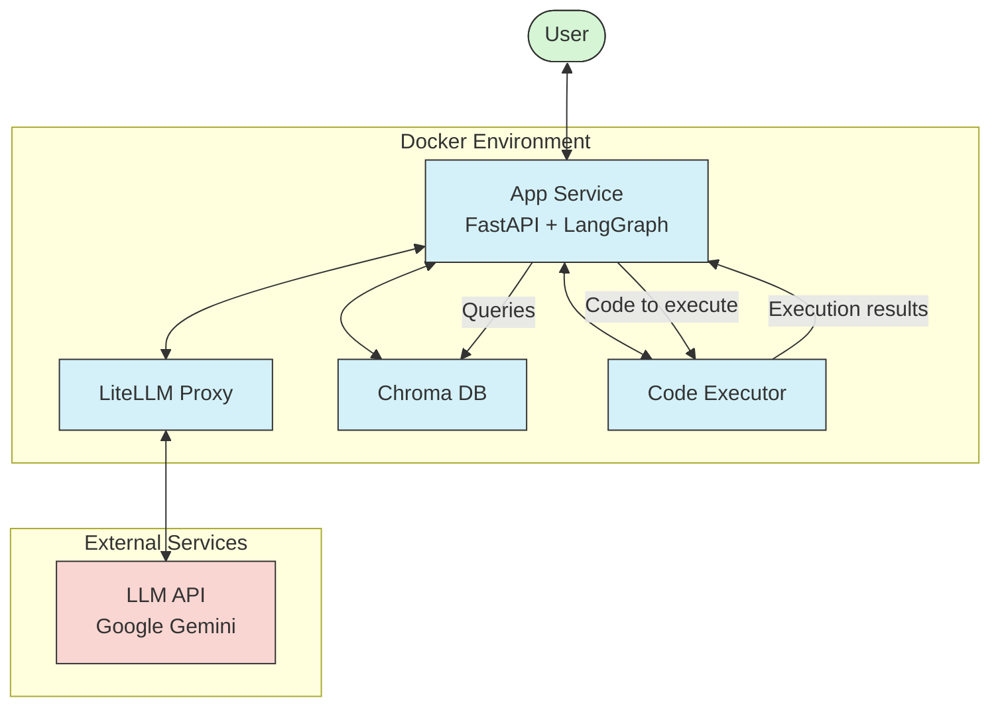
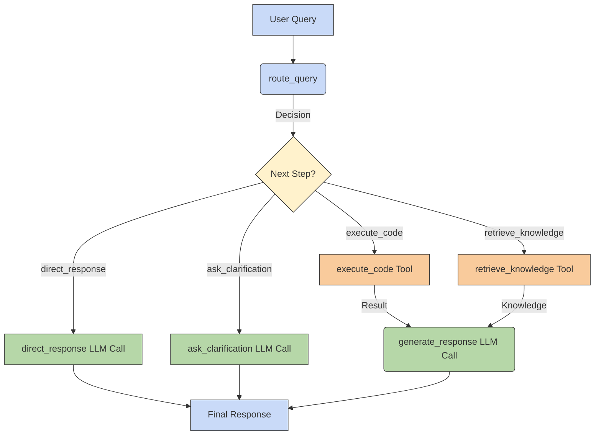

# Building the Python Tutor Agent: From Concept to Prototype

This document outlines the development process of the Python Tutor Agent, explaining the architectural choices and agent design patterns selected along the way to create the current prototype.

## 1. Defining the Core Goal

**Objective:** Create an AI assistant that can help users learn Python by:
1.  Answering general Python questions.
2.  Executing user-provided Python code snippets safely.
3.  Explaining the code, its execution, and any errors.
4.  Providing conceptual explanations related to the code or question.

## 2. Initial Architectural Considerations

Based on the core goal, several architectural components were identified:

*   **Web Interface:** Needed for user interaction. A web framework is suitable.
*   **LLM Interaction:** The core intelligence requires interaction with a Large Language Model.
*   **Code Execution:** Running arbitrary user code requires a secure, isolated environment.
*   **Knowledge Base:** To answer specific Python questions accurately, a way to retrieve relevant information is needed.
*   **Orchestration:** A central component is required to manage user requests and coordinate the other components.

### Technology Choices & Rationale:

1.  **App Service (Orchestration & Web Interface): FastAPI**
    *   **Why:** A modern Python web framework known for its speed, ease of use, async capabilities (crucial for I/O bound tasks like LLM calls and DB queries), and automatic API documentation. Being Python-based aligns with the project's theme.
    *   *Alternatives Considered:* Flask (simpler, but less feature-rich out-of-the-box), Django (more heavyweight, overkill for this scope).

2.  **Containerization: Docker & Docker Compose**
    *   **Why:** Essential for managing dependencies, ensuring consistency across development and deployment environments, and simplifying the setup of multiple services (App, DB, LLM Proxy, Code Executor). Docker Compose allows defining and running the multi-container application easily.
    *   *Alternatives Considered:* Manual setup (error-prone, hard to reproduce), Kubernetes (overkill for local development and this prototype stage, but a potential next step for scaling).

3.  **LLM Gateway: LiteLLM Proxy**
    *   **Why:** Provides a unified interface to various LLM providers (OpenAI, Anthropic, Google Gemini, etc.). This decouples the main application from specific LLM APIs, allowing easy switching or experimentation with different models without changing the core agent logic. It also centralizes API key management and can handle retries/rate limiting.
    *   *Alternatives Considered:* Direct API integration (locks the app into one provider, requires more boilerplate code for each model).

4.  **Vector Database (Knowledge Base): ChromaDB**
    *   **Why:** A popular open-source vector database that can run locally within Docker. Ideal for implementing Retrieval-Augmented Generation (RAG) by storing embeddings of Python documentation or concepts and allowing semantic search to find relevant information.
    *   *Alternatives Considered:* Pinecone/Weaviate (cloud-based, might be overkill or add external dependencies), FAISS (library, not a full database service, requires more manual setup).

5.  **Secure Code Execution: Dedicated `Code Executor` Service**
    *   **Why:** Running untrusted user code directly within the main application is a major security risk. A separate, isolated Docker container provides a sandbox. This service receives code, executes it (e.g., using `subprocess` within the container), and returns the `stdout` and `stderr`. Resource limits can also be applied to this container.
    *   *Alternatives Considered:* Executing code directly in the FastAPI app (highly insecure), using online execution APIs (adds external dependency, potential costs).

### Architectural Patterns Employed

Beyond specific technology choices, several established architectural patterns underpin the system design:

1.  **Microservices Architecture:** The separation of concerns into distinct, independently deployable Docker containers (App Service, Code Executor, LiteLLM Proxy, ChromaDB) is a core application of this pattern. 
    *   **Benefits:** Enhances modularity (easier to update or replace individual components), scalability (each service can be scaled independently based on load), resilience (failure in one service is less likely to impact others), and allows for technology diversity if needed (though here, most services are Python-based).

2.  **API Gateway Pattern (Specialized):** The `LiteLLM Proxy` functions as a specialized API Gateway focused on LLM interactions.
    *   **Benefits:** It provides a single, stable interface for the App Service to interact with potentially multiple or changing downstream LLM APIs. It encapsulates concerns like API key management, request formatting, and potentially rate limiting or retries, simplifying the App Service logic.

3.  **Externalized Configuration:** Utilizing environment variables (often managed via a `.env` file and injected by Docker Compose) for settings like API keys, database connection strings, or service endpoints keeps configuration separate from application code.
    *   **Benefits:** Improves portability across environments (development, staging, production) without code changes and enhances security by keeping sensitive credentials out of version control.

4.  **Sidecar Pattern (Conceptual Similarity):** While not a strict implementation (like a sidecar container within the same Kubernetes pod), the dedicated `Code Executor` service shares the *principle* of the Sidecar pattern.
    *   **Benefits:** It offloads a specific, auxiliary, and potentially risky task (untrusted code execution) from the main application process into a separate, isolated environment. This enhances the security and stability of the core App Service.

### Resulting High-Level Architecture

*This diagram shows the user interacting with the FastAPI App Service, which orchestrates calls to LiteLLM (for LLM reasoning), ChromaDB (for RAG), and the Code Executor service, all typically running within a Docker environment.*

## 3. Agent Design: Choosing the Right Patterns

With the architecture in place, the focus shifts to the agent's internal logic – how it decides what to do based on the user's query.

1.  **The Basic Problem: Code vs. Knowledge:** The agent needs to differentiate between a request to run code ("Run `print('hello')`") and a request for information ("What is a Python list?").

2.  **Pattern 1: Router:** This is the most fundamental pattern needed. A "router" function analyzes the user input and determines the primary intent.
    *   **Implementation:** Use simple keyword checks (`"run this code"`) or more sophisticated LLM calls/pattern matching to classify the query. This router directs the flow to different processing paths.

3.  **Pattern 2: ReAct (Reasoning and Acting) for Code Execution:** When code execution is needed, the agent shouldn't just run the code blindly. It needs to:
    *   *Reason:* Identify the code.
    *   *Act:* Send the code to the Code Executor service.
    *   *Observe:* Get the results (stdout/stderr).
    *   *Reason:* Interpret the results (success? error?), formulate an explanation, potentially identify best practices or related concepts.
    *   **Implementation:** A dedicated flow/function sequence that orchestrates these steps.

4.  **Pattern 3: RAG (Retrieval-Augmented Generation) for Knowledge:** For knowledge questions, relying solely on the LLM's parametric memory can lead to hallucinations or outdated information. RAG improves accuracy.
    *   *Reason:* Identify the core question.
    *   *Act (Retrieve):* Query ChromaDB with the user's question to find relevant Python documentation snippets.
    *   *Act (Generate):* Send the original question *and* the retrieved context to the LLM, instructing it to answer based on the provided information.
    *   **Implementation:** A flow that includes querying the vector store and constructing a context-aware prompt for the LLM.

5.  **Handling Ambiguity/Edge Cases:** What if the query is unclear ("Tell me about Python loops and run `for i in range(3): print(i)`")? Or just a greeting ("Hi")?
    *   **Router Enhancement:** The router needs to handle mixed intents (prioritizing code execution if present), simple greetings (direct LLM response), or unclear queries (ask for clarification).
    *   **Pattern: Clarification Request:** If the router cannot confidently determine the path, ask the user to clarify.

6.  **Pattern 4: Structured Output:** Raw LLM output can be inconsistent. For an educational tool, a clear, predictable format is better.
    *   **Implementation:** Define a clear structure in the system prompt (e.g., ## Explanation, ## Code Analysis, ## Execution Results, ## Errors & Solutions). Instruct the LLM to *always* follow this format, even if some sections are empty. Use Markdown for formatting.

7.  **Special Case: Mathematical Expressions:** Queries like "What is 2+2?" or "Calculate sqrt(16)" often benefit from precise execution rather than just LLM estimation.
    *   **Router Enhancement:** Add logic to detect mathematical expressions.
    *   **Decision:** Treat mathematical expressions as code to be executed. Convert the natural language ("sqrt(16)") into executable Python (`import math; math.sqrt(16)`), then route it through the Code Execution (ReAct) path.

8.  **Tying it Together: LangGraph**
    *   **Why:** As the logic grows (router, code path, knowledge path, clarification path, math handling), simple if/else statements become complex and hard to manage. LangGraph provides a framework for defining the agent's logic as a state machine or graph.
    *   **Benefits:**
        *   **Modularity:** Each step (routing, executing code, retrieving knowledge, generating response) becomes a distinct node.
        *   **State Management:** Explicitly defines the information (`AgentState`) passed between steps.
        *   **Flexibility:** Conditional edges allow dynamic routing based on the state.
        *   **Visualization:** The graph structure can be visualized (e.g., via Mermaid generated from the graph or LangSmith tracing).
        *   **Maintainability:** Easier to add, remove, or modify steps (nodes/edges) compared to deeply nested conditional logic.
    *   **Implementation:** Define the `AgentState`, create functions for each node (router, tools, response generation), and add nodes and edges to the `StateGraph` builder in `app/agent.py`.

### Agent Logic Flow (Simplified LangGraph)

*This diagram illustrates the flow within the LangGraph agent. The `route_query` node determines the next action (calling a tool, responding directly, or asking for clarification). Tool results feed into the final `generate_response` node.*

## 4. Implementation Steps (High-Level Recap)

1.  **Project Setup:** Create directory structure (`app`, `docker`, `docs`, etc.).
2.  **Docker Config (`docker-compose.yml`):** Define services for `app`, `lite-llm-proxy`, `chroma`, `code-executor`. Include necessary configurations (ports, volumes, environment variables).
3.  **LiteLLM Config (`config.yaml`):** Configure model list, API keys (via environment variables).
4.  **Code Executor Service:** Create a simple service (e.g., Flask or FastAPI) that accepts code via POST, runs it in a subprocess, and returns JSON with stdout/stderr.
5.  **ChromaDB Integration:** Add client code in `app` to connect to ChromaDB, create collections, add documents (potentially via a separate ingestion script), and perform queries.
6.  **FastAPI App Service:**
    *   Set up main app file (`main.py`).
    *   Define API endpoints (e.g., `/chat`).
    *   Implement the core agent logic using LangGraph (`app/agent.py`):
        *   Define `AgentState`.
        *   Implement node functions (router, tools, response generation).
        *   Build the graph using `StateGraph`.
        *   Instantiate and compile the graph.
    *   Implement helper functions (`llm_calls.py`, `tools.py`, `vector_store.py`).
7.  **Frontend:** Create basic HTML (`templates/index.html`) and JavaScript (`static/script.js`) for a chat interface that interacts with the FastAPI `/chat` endpoint. Include libraries for markdown rendering (Marked.js) and syntax highlighting (Highlight.js).
8.  **Refinements:** Add logging, environment variable handling (`.env`), LangSmith integration for tracing/debugging, detailed system prompts, and robust error handling.
9.  **Documentation:** Update `README.md` with setup instructions, architecture diagrams, and usage examples. Create supplementary documents like this one (`development_process.md`) and `llm_design_patterns.md`.

## 5. Conclusion

Building the Python Tutor Agent involved starting with core requirements, making deliberate architectural choices to support those requirements (FastAPI, Docker, LiteLLM, ChromaDB, dedicated Code Executor), and then iteratively designing the agent's internal logic using established LLM patterns (Router, ReAct, RAG, Structured Output). LangGraph was chosen as the framework to implement this logic in a modular, maintainable, and visualizable way, resulting in the current prototype.
